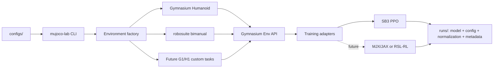

# mujoco_lab

A documentation-first MuJoCo robotics learning lab for **humanoid locomotion** and **bimanual manipulation**.

The repository is intentionally built as a small research platform rather than a collection of one-off scripts: environments expose Gymnasium-compatible interfaces, algorithms live behind training adapters, robot assets are external/versioned, and every experiment is driven by a checked-in configuration.

## Learning tracks

| Track | First runnable baseline | Next production-grade target |
| --- | --- | --- |
| Humanoid locomotion | Gymnasium `Humanoid-v5` + PPO | Unitree G1/H1 command-conditioned walking with Menagerie assets, curriculum and domain randomization |
| Bimanual manipulation | robosuite `TwoArmLift` + PPO | Handover / peg-in-hole, demonstrations, ALOHA-style ACT and Diffusion Policy |
| Acceleration | CPU/GPU SB3 | MJX/JAX batched simulation and high-throughput training |
| Deployment | deterministic evaluation | policy export, sim-to-sim and sim-to-real interfaces |

## Why this stack

- **MuJoCo** is the physics source of truth.
- **Gymnasium** is the environment contract, which prevents training code from depending on one simulator wrapper.
- **Stable-Baselines3 PPO** is the first baseline because it is readable, mature and supports continuous actions and vectorized environments.
- **robosuite** supplies well-designed two-arm MuJoCo tasks and an official Gym-compatible wrapper.
- **MuJoCo Menagerie** supplies curated robot models such as Unitree G1 and H1 without vendoring large third-party assets into this repository.
- **MJX** is a planned second backend for accelerator-parallel locomotion once the CPU baseline and task semantics are proven.

## Quick start

Python 3.11 or 3.12 is recommended. `uv` is the preferred environment manager.

```bash
git clone https://github.com/magic-alt/mujoco_lab.git
cd mujoco_lab

uv sync --extra train --extra dev
uv run mujoco-lab doctor
uv run mujoco-lab inspect-env configs/humanoid/humanoid_v5_ppo.yaml
uv run mujoco-lab train configs/humanoid/humanoid_v5_ppo.yaml
```

For the bimanual track:

```bash
uv sync --extra train --extra bimanual --extra dev
uv run mujoco-lab inspect-env configs/bimanual/two_arm_lift_ppo.yaml
uv run mujoco-lab train configs/bimanual/two_arm_lift_ppo.yaml
```

Evaluate a checkpoint:

```bash
uv run mujoco-lab evaluate \
  configs/humanoid/humanoid_v5_ppo.yaml \
  runs/humanoid-v5-ppo/model.zip \
  --episodes 5
```

Use `--no-render` for headless servers.

## Architecture



The dependency rule is strict: **task/environment code must not import the RL algorithm implementation**. This keeps reward/observation/control semantics testable independently of PPO, SAC, ACT or any future trainer.

## Repository map

```text
mujoco_lab/
├── configs/                 # versioned experiment inputs
│   ├── humanoid/
│   └── bimanual/
├── docs/
│   ├── adr/                 # architecture decisions
│   ├── research/            # source-backed landscape notes
│   └── tutorials/           # progressive learning path
├── src/mujoco_lab/
│   ├── envs/                # simulator/task adapters
│   ├── training/            # algorithm adapters
│   ├── config.py            # config schema + validation
│   └── cli.py               # train/evaluate/inspect/doctor
├── tests/                   # fast contract and smoke tests
├── AGENTS.md                # repository rules for AI coding agents
└── .github/workflows/ci.yml
```

## Tutorial path

1. [Environment setup](docs/tutorials/00_getting_started.md)
2. [MuJoCo fundamentals](docs/tutorials/01_mujoco_fundamentals.md)
3. [Humanoid walking](docs/tutorials/02_humanoid_walking.md)
4. [Bimanual training](docs/tutorials/03_bimanual_training.md)
5. [AI-coding workflow](docs/tutorials/04_ai_coding_workflow.md)
6. [Experiment protocol](docs/experiment_protocol.md)
7. [Architecture](docs/architecture.md)
8. [Roadmap](docs/roadmap.md)
9. [Research landscape](docs/research/2026-09-04-landscape.md)

## Current scope

This bootstrap implements the **Phase 0 / Phase 1 foundation**: project packaging, config schema, environment factory, SB3 PPO runner, deterministic evaluation path, Gymnasium Humanoid smoke test, robosuite two-arm adapter, CI, architecture decisions, research notes and the initial tutorials.

The next vertical slice is a **Menagerie Unitree G1 walking environment** with explicit observation/action contracts and decomposed rewards. See the roadmap for acceptance gates.

## Research discipline

A training run is not considered evidence because a video looks plausible. Results should report multiple seeds, task success/return statistics, training budget, simulator/model version and evaluation conditions. Do not commit large model assets, datasets or checkpoints; record their provenance and version instead.

## License

Apache-2.0. Third-party robot assets and datasets retain their own licenses; verify them before redistribution.
